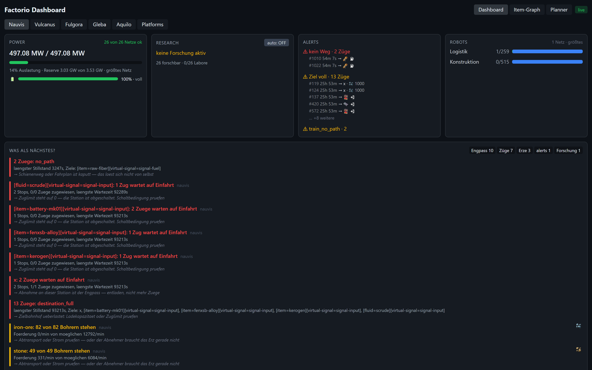
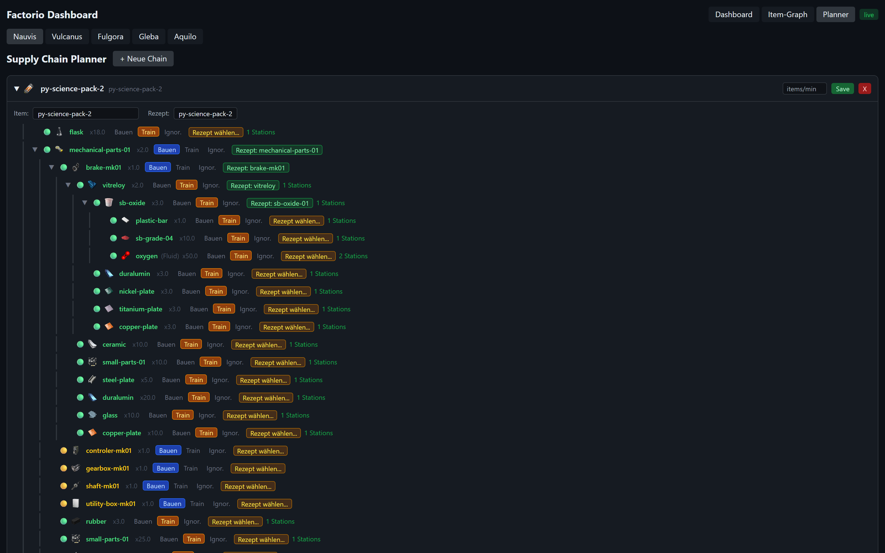
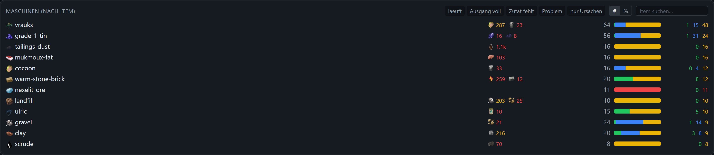
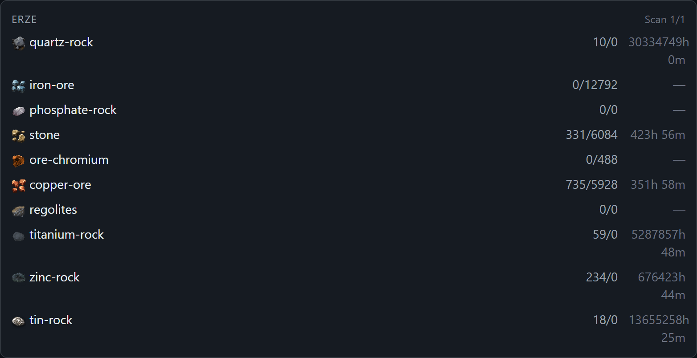
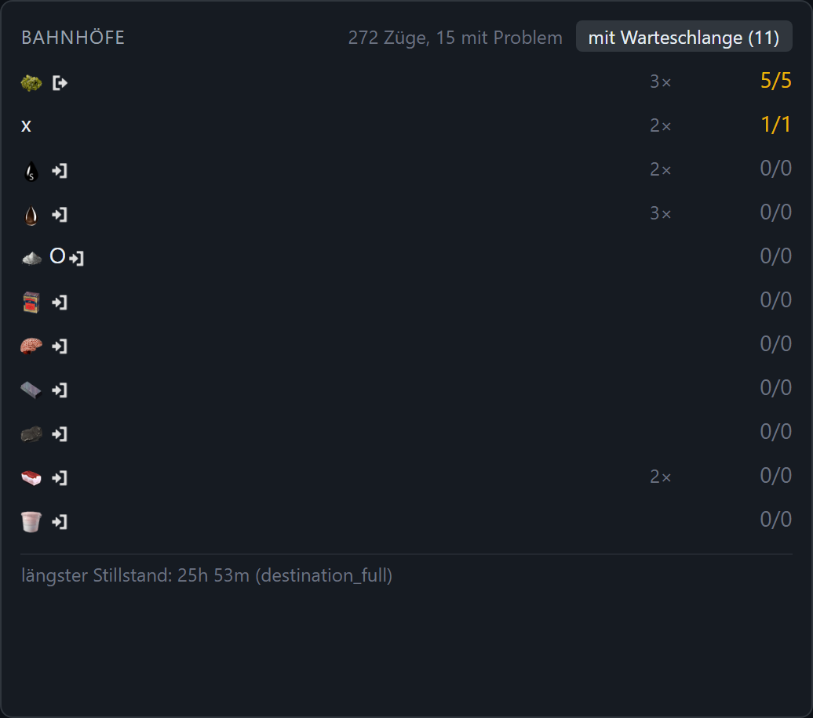
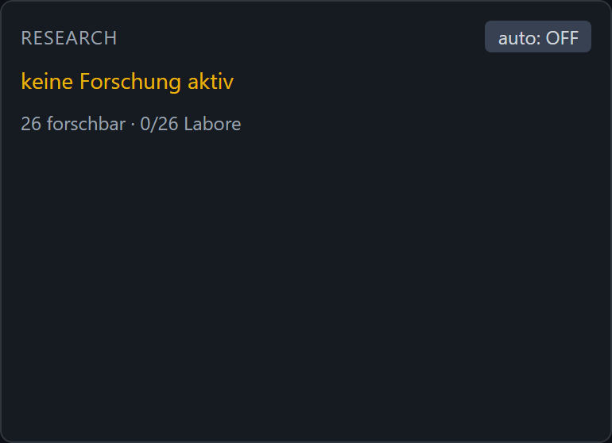

# Factorio Dashboard

Second-screen dashboard for Factorio (2.0 / Space Age): a **Factorio mod** as the data source,
an ASP.NET Core API with SignalR, and a React frontend.

The repository holds both halves:

```
mod/fdash-exporter/   The Factorio mod (Lua). Collects under a budget, writes snapshots.
src/                  The web server (C#). Reads snapshots, stores time series, serves the UI.
web/                  The frontend (React + TS + Vite + Tailwind + uPlot).
```

## Screenshots

Overview — power, research, alerts and robots at a glance:



Supply chain planner with per-ingredient train availability (provider stations marked green):



Machine status grouped by bottleneck, ore patches with remaining lifetime, and the train network:

| Machines | Resources | Trains |
|---|---|---|
|  |  |  |

Research queue and science-pack throughput:



## Why a mod instead of RCON

The first version pulled everything over RCON `/silent-command`. That works — but every poll
runs the entire query **inside a single game tick**. A `find_entities_filtered{type=
"assembling-machine"}` walks every entity on the surface; on a large modded base that is a
six-figure number, several times a minute. The result was noticeable stutter.

The mod inverts the arrangement. It keeps its own view of the factory, advances it only a
little each tick under a **hard budget**, and hands out a finished snapshot. Fetching then
costs nothing, because there is nothing left to compute.

| | before (RCON snippets) | now (mod) |
| --- | --- | --- |
| Where the work happens | in the tick, on every poll | spread across many ticks |
| Cost per tick | grows with the factory | fixed (`fdash-entity-budget`) |
| Entity lists | searched again every time | scanned once, maintained from events |
| Ore scan | full scan every 60 s | rolling, a few chunks per tick |
| Ore under drills | one area scan **per drill**, every 60 s | cached per drill, refreshed every 10 min |
| Recipe lookups | over all recipes on every poll | once per session |
| RCON required | yes | only for auto-research |

Details and tuning: [`mod/fdash-exporter/README.md`](mod/fdash-exporter/README.md).

## Setup

### 1. Build and install the mod

```bash
powershell -ExecutionPolicy Bypass -File .\mod\build-mod.ps1 -Install
```

This packs `mod/fdash-exporter` into `mod/dist/fdash-exporter_<version>.zip` and drops it into
`%APPDATA%\Factorio\mods`. A portable Factorio (zip package) keeps its mods under the install
directory instead — pass `-ModsDir C:\path\to\Factorio\mods`. For a dedicated server, copy the
zip to wherever that server's `mods` directory lives. Then restart Factorio or the server.

On first start the mod scans the map once, in chunks. On large maps that takes a minute or
two; `meta.exporter.scanning` reports the progress while it runs.

### 2. Configure the web server

`src/Fdash.Api/appsettings.json`:

- `Collector:Transport` — `Auto` (default), `File` or `Rcon`.
- `Collector:ScriptOutputPath` — Factorio's `script-output` directory. The mod creates
  `fdash/` underneath it. `%APPDATA%` is expanded.
- `Collector:PollIntervalMs` — how often to check for a new snapshot (default 1000).

**Transports**

- **File** (preferred): dashboard and Factorio share a filesystem. No RCON password, no tick
  slot per fetch.
- **RCON**: dashboard runs elsewhere. Needs `Collector:RconPassword`. The mod does not compute
  anything in the tick here either — the commands just return finished strings.

`Auto` uses the file transport as soon as the mod writes there, and RCON otherwise.

**The RCON password does not belong in the repository.** Use either
`src/Fdash.Api/appsettings.Local.json` (excluded via `.gitignore`, a template sits next to it
as `appsettings.Local.example.json`) or an environment variable:

```bash
Collector__RconPassword=secret
```

RCON is only mandatory for **auto-research** — the single writing path. Without it the
dashboard still shows a research suggestion, it just does not apply it.

### 3. Icons (optional)

The prototype-to-PNG mapping comes from `data-raw-dump.json`, because the runtime API does not
expose icon paths. Generate it once — and after every mod change:

```
"C:\Program Files\Factorio\bin\x64\factorio.exe" --dump-data
```

It lands in `%APPDATA%\Factorio\script-output\data-raw-dump.json`. Without it the dashboard
only guesses from the file name, so items whose icon file is named differently stay blank.

## Build and run

```bash
dotnet build FactorioDashboard.sln
dotnet run --project tests/Fdash.Tests      # self-tests
```

Frontend (output goes to `src/Fdash.Api/wwwroot` → one process, one port):

```bash
cd web
npm install
npm run build
```

Run it:

```bash
dotnet run --project src/Fdash.Api          # http://localhost:5000
```

On Windows `start.bat` also works (it prefers the published exe if there is one). For a
hot-reloading dev frontend, run `cd web && npm run dev` separately (port 5173, proxies `/api`
and `/hub` to 5000).

Publish self-contained:

```powershell
powershell -ExecutionPolicy Bypass -File .\publish.ps1
.\publish\Fdash.Api.exe
```

## Checking that data arrives

```
http://localhost:5000/api/health
```

reports the transport in use, whether writing is possible, whether the prototypes are loaded,
and the mod's raw status.

There is also a diagnostic tool that needs no running backend — it lists every job with its
age and payload size:

```bash
FDASH_SCRIPT_OUTPUT="%APPDATA%\Factorio\script-output" dotnet run --project tests/Fdash.LiveCheck
```

Or over RCON, via `FDASH_HOST`, `FDASH_PORT`, `FDASH_PASS`.

In game: `/fdash-status`.

## MCP server for an AI

The dashboard also speaks [MCP](https://modelcontextprotocol.io), so a model can ask about the
factory instead of you reading panels. It runs inside the same process, as Streamable HTTP:

```bash
claude mcp add --transport http fdash http://localhost:5000/mcp
```

Reading costs the game nothing. The tools read the snapshot bus and the SQLite series the
collector has already filled — no RCON round trip, no tick spent per question.

| Tool | Answers |
| --- | --- |
| `get_health` | Is data arriving at all, over which transport, and how old is each job? |
| `get_base_snapshot` | Power, research, machines, top bottlenecks, trains, robots, biggest deficits — one call. |
| `get_problems` | Everything that is wrong right now, ranked, each with evidence and a suggestion. |
| `get_machine_status_summary` | Machines per produced item: running, waiting for input (look upstream), output blocked (look downstream), and what is missing. |
| `get_production_stats` | Produced/consumed per minute with a trend, so "just started" is distinguishable from "collapsing". |
| `get_research_state` | Running research with progress and ETA, the queue, and the science pack that limits your SPM. |
| `get_power_report` | Per network: production, demand, headroom, accumulator charge trend, and how often it fell short in the window. |
| `get_recipe_tree` | The chain around an item — prototype structure crossed with the live rate, machine count and unlocking technology. |
| `get_recipe_ingredients` | Only the direct ingredients, one level deep — the cheap step you iterate with instead of pulling a whole tree. |
| `get_fluid_report` | Tank levels per fluid with trend and buffer state, plus which fluids nobody consumes. |
| `get_train_report` | Trains by state with how long they have been stuck, and stations against their train limit. |
| `get_train_network_items` | What the rail network carries, deduplicated from the station names — with `items=`, a one-call answer to "does the network have X?". |
| `get_logistic_and_storage` | Robot networks and what is actually stored, in the network and (optionally) in chests. |
| `get_history` | A metric over time as buckets with min/max and a trend, not a raw point cloud. |
| `diagnose_item_chain` | Walks the chain upstream and names the first stage that actually stops — with numbers and what to do. |
| `plan_production` | How many machines per step for a target rate, using the measured crafting speed, and which step is the limit. |
| `suggest_next_research` | Ranked research options — fastest, cheapest, unblocks the most, or fixes a current shortage. |
| `get_technology` | One technology in detail, plus the ordered path of every missing prerequisite — "what is still missing until X". |
| `get_resource_patches` | Ore patch by patch: centre, remaining, depletion, drills — the answer to "when do I need a new outpost". |
| `get_pollution_and_threat` | Evolution with its breakdown, pollution produced against absorbed, buildings lost. |
| `get_snapshot` | Raw job payload — the escape hatch for anything without its own tool. |
| `set_research` ⚠️ | The one writing tool. Off unless `Mcp:AllowWriteTools` is set, and it needs RCON. |

Two rules shape every answer: lists are capped and say so (`truncated`, `total_available`), and
every answer carries `data_age_seconds`, because a job that runs every 60 s can otherwise not be
told apart from a value that is genuinely zero.

Settings live under `Mcp` in `appsettings.json`. Writing is guarded in three independent places:
the server must allow it (`AllowWriteTools`) **and** the tool must be on the whitelist; it needs
RCON, because the file transport is one-way; and the mod validates the call itself — only an
unlocked, unresearched technology with an empty queue. That last check is the one that counts,
because it holds no matter who sends the call. There is no tool that executes arbitrary Lua;
everything goes through the mod's fixed `remote` interface.

## Architecture

```
Factorio + fdash-exporter
   │  budgeted sweeps, double buffering, pre-serialised JSON
   ▼
script-output/fdash/  ──or──  RCON remote.call("fdash","snapshot")
   │
   ▼
GameLink (transport choice)  →  CollectorService
                                   ├─ SnapshotBus  → SignalR → React
                                   │                └────────→ MCP tools (/mcp)
                                   ├─ SqliteTimeSeriesStore (roll-up tiers)
                                   ├─ StallDetector
                                   ├─ derived jobs (Fdash.Analysis)
                                   │    ├─ trains_derived — how long a train has been stuck
                                   │    └─ problems       — ranked across all domains
                                   └─ AutoResearchService  ──RCON──▶  set_research
```

The derived jobs go on the same bus as everything else. That is deliberate: the dashboard panel
and the MCP tool then show the same ranking, computed once, instead of two implementations
drifting apart — which is exactly what had happened with the root-cause analysis, which existed
only in the frontend.

Job intervals live in the mod, not in the server any more. The server only reads what is
there and uses a per-job timestamp to tell what changed.

## Publishing

Before the first upload to the mod portal: [`RELEASING.md`](RELEASING.md).

## History

The original design collected without a mod, purely over RCON. It is preserved for context in
[`factorio-dashboard-plan.md`](factorio-dashboard-plan.md) and
[`QUESTIONS.md`](QUESTIONS.md) — both describe an architecture that no longer exists.

## License

MIT — see [`LICENSE`](LICENSE).
